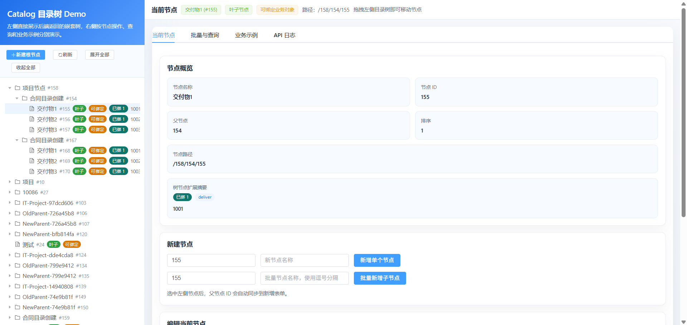
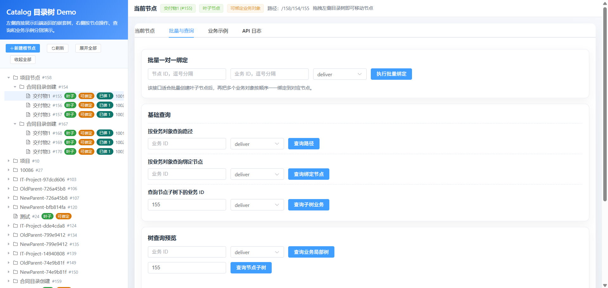
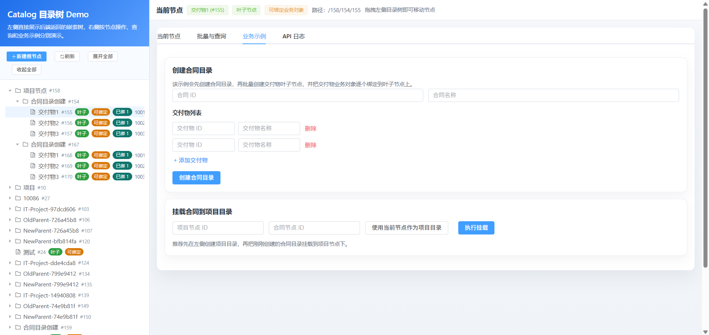
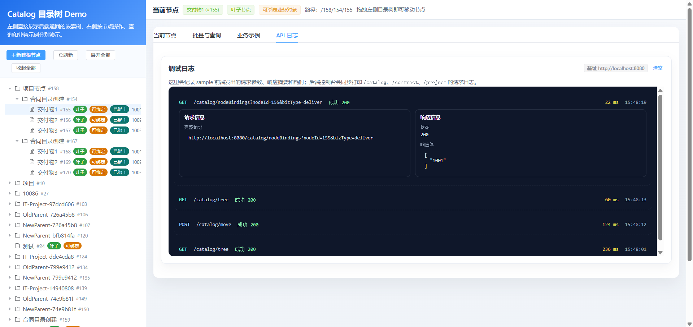

# Catalog Spring Boot Starter

通用目录树管理组件 - 开箱即用的 Spring Boot Starter

## ✨ 特性

- 🌳 **树形结构管理** - 支持无限层级的目录树
- 🔗 **业务对象绑定** - 叶子节点可选绑定业务对象，单个业务对象只绑定一个目录节点
- 🎯 **拖拽排序** - 支持节点移动和排序
- 🚀 **高性能查询** - 路径冗余设计，避免递归查询
- 🔧 **开箱即用** - Spring Boot Starter 一键集成

## 📦 快速开始

### 1. 添加依赖

```xml
<dependency>
    <groupId>io.github.zhubn123</groupId>
    <artifactId>catalog-spring-boot-starter</artifactId>
    <version>1.0.0-SNAPSHOT</version>
</dependency>
```

### 2. 创建数据库表

```sql
-- 目录节点表
CREATE TABLE catalog_node (
    id BIGINT PRIMARY KEY AUTO_INCREMENT,
    parent_id BIGINT DEFAULT 0,
    name VARCHAR(100) NOT NULL,
    code VARCHAR(50),
    path VARCHAR(500),
    level INT,
    sort INT,
    INDEX idx_parent_sort_id (parent_id, sort, id),
    INDEX idx_path (path)
);

-- 业务绑定关系表
CREATE TABLE catalog_rel (
    id BIGINT PRIMARY KEY AUTO_INCREMENT,
    node_id BIGINT NOT NULL,
    biz_id VARCHAR(100) NOT NULL,
    biz_type VARCHAR(50) NOT NULL,
    UNIQUE KEY uk_biz (biz_id, biz_type),
    INDEX idx_node_type (node_id, biz_type)
);
```

> 说明：
> - 目录节点可以只作为容器，不必绑定业务对象
> - 只有叶子节点允许绑定业务对象
> - 单个叶子节点可以绑定多个业务对象
> - 同一 `biz_type + biz_id` 最多绑定一个目录节点
### 3. 配置 sample 本地环境

```yaml
mybatis:
  mapper-locations: classpath:mapper/*.xml
```

1. 复制 `samples/catalog-demo/src/main/resources/application-local.yml.example`
   为 `samples/catalog-demo/src/main/resources/application-local.yml`
2. 按本机环境填写数据库连接信息
3. 直接启动 sample：

```bash
mvn -f samples/catalog-demo/pom.xml spring-boot:run
```

> 仓库中的 `application.yml` 只保留公共配置；
> `application-local.yml` 已加入 `.gitignore`，不会误把本地敏感信息提交进仓库。
> sample 默认使用 `local` profile；如果你想切到别的 profile，再显式传入即可。

### 4. 构建与发布

- 日常开发构建直接使用 `mvn test` 或 `mvn package`，默认流程只保留编译、测试和普通打包。
- 如需生成发布用的 `sources/javadocs` 制品，可显式启用 `release` profile：

```bash
mvn -Prelease verify
```

- 如需在此基础上继续生成带签名的发布制品，再额外启用 `release-sign` profile：

```bash
mvn -Prelease,release-sign verify
```

- GitHub Packages 发布由 `.github/workflows/maven-publish.yml` 负责，只在推送 `v*` 标签或手动触发 workflow 时执行，并在 CI 中显式启用 `release` profile。
- workflow 中使用 `-Dgpg.skip=true`，避免把本地发布签名要求带进日常 CI。

### 5. 使用服务

```java
@Autowired
private CatalogService catalogService;

// 创建目录
Long projectId = catalogService.addNode(0L, "我的项目");
Long contractId = catalogService.addNode(projectId, "合同A");
Long deliveryId = catalogService.addNode(contractId, "交付物A");

// 目录节点可以只做容器，不必绑定业务对象
// 叶子节点可选绑定业务对象；单个叶子节点也可以聚合同类型的多个业务对象
catalogService.bind(deliveryId, "DELIVER-001", "deliver");

// 查询业务路径（单个业务对象最多绑定一个目录节点）
List<CatalogNode> path = catalogService.getBizPath("DELIVER-001", "deliver");
```


## 🎬 演示

### Demo 入口

启动 sample 后，打开index.html：

```text
samples/catalog-demo/src/main/resources/static/catalog-demo/index.html
```

### 展示顺序

1. 目录树浏览与拖拽移动
2. 叶子节点业务绑定与解绑
3. 业务路径、局部树、子树查询
4. sample 前端 API 日志与后端请求/SQL 日志


1. 目录树主界面
   
   展示内容：左侧目录树、右侧节点概览、拖拽排序入口

2. 查询与绑定
   
   展示内容：叶子节点绑定、路径查询、局部树查询结果

3. 业务示例
   
   展示内容：二级目录 -> 三级级目录 -> 一级目录后绑定+二级目录挂载

4. API日志
   
   展示内容：前端 API 日志页签，以及 sample 控制台里的请求/SQL 日志

### 演示说明

- `/catalog/tree` 更适合 sample、管理后台和小规模场景演示。
- 真正的业务接入更推荐按父节点逐层加载，而不是默认整树全量查询。
- sample 当前重点展示的是目录树能力、绑定语义和调试链路，不是完整业务系统。
## 📖 API 文档

完整 REST 接口说明、请求体示例、错误码和接口选择建议见：

- [docs/api-reference.md](docs/api-reference.md)


### 节点操作

| API | 方法 | 说明 |
|-----|------|------|
| `/catalog/node` | POST | 创建节点 |
| `/catalog/node/batch` | POST | 批量创建 |
| `/catalog/move` | POST | 移动节点 |
| `/catalog/node/update` | POST | 更新节点 |
| `/catalog/node/delete` | POST | 删除节点 |

### 业务绑定

| API | 方法 | 说明 |
|-----|------|------|
| `/catalog/bind` | POST | 绑定业务对象 |
| `/catalog/bind/batch` | POST | 兼容接口，仅允许单业务对象绑定单个节点 |
| `/catalog/bind/pairs` | POST | 批量一对一绑定 |
| `/catalog/unbind` | POST | 解除绑定 |

### 查询

| API | 方法 | 说明 |
|-----|------|------|
| `/catalog/children` | GET | 按父节点查询直接子节点列表，适合懒加载 |
| `/catalog/childrenPage` | GET | 按父节点分页查询直接子节点，适合大兄弟集合 |
| `/catalog/nodes` | GET | 获取完整目录的扁平节点列表 |
| `/catalog/tree` | GET | 获取完整目录的嵌套树结构 |
| `/catalog/bizPath` | GET | 查询业务路径 |
| `/catalog/bizTreeNodes` | GET | 查询业务局部树对应的扁平节点列表 |
| `/catalog/bizTree` | GET | 查询业务局部树的嵌套树结构 |
| `/catalog/subtreeNodes` | GET | 查询指定节点子树的扁平节点列表 |
| `/catalog/subtree` | GET | 查询指定节点子树的嵌套树结构 |

> `children` 只返回某个父节点下的直接子节点，更适合作为生产场景里的默认树查询入口。
> `childrenPage` 在 `children` 的基础上补充分页元数据，适合根节点较多或热点父节点场景。
> `nodes`、`bizTreeNodes`、`subtreeNodes` 返回的都是按树遍历顺序排列的扁平节点列表。
> `tree`、`bizTree`、`subtree` 会在后端完成 `children` 组装，直接返回嵌套树结构。
> 树形节点额外包含 `leaf`、`bindable` 与 `extensions` 字段，便于后续继续扩展叶子节点业务装配策略。

### 树节点扩展策略

- 默认情况下，后端会把叶子节点标记为 `leaf=true`、`bindable=true`。
- 如果你希望在树节点上补充业务摘要、绑定统计或叶子节点挂载信息，可以实现 `CatalogTreeNodeEnricher` Bean。
- 自定义策略会在树组装完成后执行，推荐把附加信息写入 `extensions`，避免频繁变更基础返回结构。

## 🔧 配置项

```yaml
catalog:
  enabled: true              # 是否启用
  enable-rest-api: true      # 是否启用REST API
```

> 当前公开配置仅保留已落地生效的选项；`table-prefix`、`init-schema` 等历史占位配置已移除。

## 🏗️ 项目结构

```
catalog-spring-boot-starter/
├── catalog-core/                    # 核心模块
│   ├── domain/                      # 领域模型
│   ├── service/                     # 服务接口和实现
│   ├── mapper/                      # 数据访问层
│   └── exception/                   # 异常定义
├── catalog-spring-boot-autoconfigure/  # 自动配置
└── catalog-spring-boot-starter/     # Starter聚合
```

## 📝 核心设计

### 业务绑定约束

- 目录节点可以只作为容器，不必绑定业务对象
- 只有叶子节点（无子节点）才能绑定业务对象
- 单个叶子节点可以绑定多个业务对象
- 同一 `bizType + bizId` 最多绑定一个目录节点
- 批量绑定推荐使用“多组一对一绑定”；不要让一个业务对象绑定多个节点

### 排序策略

- 同级节点默认采用“跳跃排序”策略分配 `sort` 值，而不是要求连续整数
- 调整位置时会优先复用相邻节点之间的空隙，只有空隙耗尽时才对局部兄弟节点做重排
- 调用方应只依赖“按 `sort` 升序即可得到正确顺序”，不要依赖 `sort` 连续或从 `1` 开始

### 路径冗余设计

```
节点路径：/1/2/3
- 查询子树：WHERE path LIKE '/1/2/%'
- 查询祖先：解析 path 中的 ID 列表
```

## 📄 License

Apache License 2.0
